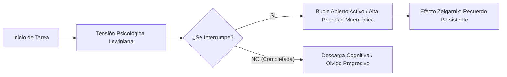

# 🧠 El Efecto Zeigarnik — Landing Page Interactiva & AI Skill

<div align="center">


<br/>

[](https://developer.mozilla.org/es/docs/Web/HTML)
[](https://developer.mozilla.org/es/docs/Web/CSS)
[](https://developer.mozilla.org/es/docs/Web/JavaScript)
[](file:///c:/Users/USER/Downloads/EfectoZeigarnik/efecto-zeigarnik.md)
[](#)
[](file:///c:/Users/USER/Downloads/EfectoZeigarnik/video.mp4)
[](file:///c:/Users/USER/Downloads/EfectoZeigarnik/Infografia.png)

<br/>

**Plataforma web interactiva para experimentar, comprender y aplicar el Efecto Zeigarnik en la productividad personal, el marketing narrativo y la memoria.**

[Ver Landing Page](file:///c:/Users/USER/Downloads/EfectoZeigarnik/index.html) • [Explorar la Skill](file:///c:/Users/USER/Downloads/EfectoZeigarnik/efecto-zeigarnik.md) • [Ver Infografía](file:///c:/Users/USER/Downloads/EfectoZeigarnik/Infografia.png) • [Ver Video](file:///c:/Users/USER/Downloads/EfectoZeigarnik/video.mp4)

</div>

---

## 📖 Tabla de Contenidos
1. [¿Qué es el Efecto Zeigarnik?](#-qué-es-el-efecto-zeigarnik)
2. [Características Principales](#-características-principales)
3. [La Skill: `efecto-zeigarnik.md`](#-la-skill-efecto-zeigarnikmd)
4. [Recursos Multimedia Integrados](#-recursos-multimedia-integrados)
   - [Infografía Oficial](#1-infografía-oficial-infografiapng)
   - [Video Animado HD](#2-video-animado-hd-videomp4)
5. [Estructura del Repositorio](#-estructura-del-repositorio)
6. [Cómo Usar y Ejecutar el Proyecto](#-cómo-usar-y-ejecutar-el-proyecto)
7. [Fundamentos Científicos y Referencias](#-fundamentos-científicos-y-referencias)
8. [Licencia](#-licencia)

---

## 🧐 ¿Qué es el Efecto Zeigarnik?

El **Efecto Zeigarnik** es la tendencia psicológica humana a **recordar con mayor nitidez y detalle las tareas interrumpidas o inacabadas** en comparación con aquellas que ya se han completado con éxito.

> *"Cuando una tarea se interrumpe, el cerebro mantiene un hilo de tensión cognitiva en la memoria operativa ('bucle abierto') que no se disipa hasta que el ciclo se concluye o se gestiona conscientemente."*  
> — **Bluma Zeigarnik (1927)**



---

## ✨ Características Principales

### 🌐 1. Landing Page de Alta Fidelidad (`index.html`)
- **Estética Editorial Premium:** Paleta de colores cálida basada en tonos bosque (`#1E352B`), terracota (`#C85A32`), crema pergamino (`#FBF8F3`) y acentos dorados (`#D4A373`).
- **100% Responsive & Accesible:** Diseñada para pantallas móviles, tabletas y monitores de escritorio.
- **Tipografía Moderna:** Combinación tipográfica con *Playfair Display*, *Outfit* y *JetBrains Mono*.

### ⚡ 2. Laboratorio de la Skill en Vivo
- Ejecuta los 4 protocolos de la Skill directamente en el navegador sin configuraciones complejas.
- **Modos disponibles:**
  1. 🛑 **Vencer Procrastinación:** Micro-arranques de 3 minutos e interrupciones tácticas.
  2. 🎬 **Cliffhangers & Storytelling:** Estructuración de bucles abiertos anidados para retener audiencias.
  3. 📚 **Pausas de Estudio Estratégicas:** Cortes deliberados en el clímax temático para fijar memoria a largo plazo (+90% retención).
  4. 🧘 **Higiene Mental & Cierre Consciente:** Protocolo para descargar la rumiación nocturna y el estrés de tareas pendientes.
- Presets rápidos con un clic ("Informe aburrido", "Retomar gimnasio", "Email comercial", etc.).
- Copia directa al portapapeles y exportación en formato Markdown (`.md`).

### 🖼️ 3. Visualizador Lightbox de Infografía (`Infografia.png`)
- Despliegue de la infografía oficial con visor modal en alta resolución y zoom.
- Tarjetas interactivas con los 5 pilares clave de la investigación de Adrián Triglia (*Psicología y Mente*).
- Enlace de descarga directa del asset en PNG.

### 🎥 4. Reproductor Adaptado para Video (`video.mp4`)
- Marco vertical tipo *Smartphone Showcase* optimizado para video 9:16.
- **Saltos de capítulos interactivos con un clic:**
  - `⏱️ 0:00` — ¿No puedes dejar de pensar en lo que dejaste a medias?
  - `⏱️ 0:04` — Tareas Incompletas = Mente Activa.
  - `⏱️ 0:10` — El Informe y la Laptop.
  - `⏱️ 0:16` — Cliffhangers en Series.
  - `⏱️ 0:22` — La Solución: Cierre Consciente.

### 🧪 5. Mini-Experimento Cognitivo 3D
- Prueba práctica en tiempo real con 5 palabras donde una sufre una interrupción forzada.
- Demostración empírica de cómo la palabra interrumpida se fija prioritariamente en la memoria a corto plazo.

---

## 🛠️ La Skill: `efecto-zeigarnik.md`

El archivo [`efecto-zeigarnik.md`](file:///c:/Users/USER/Downloads/EfectoZeigarnik/efecto-zeigarnik.md) está estandarizado para asistentes y agentes de Inteligencia Artificial (Antigravity, Claude, OpenAI GPTs, etc.):

```yaml
---
name: efecto-zeigarnik
description: Skill de psicología cognitiva y productividad basada en el Efecto Zeigarnik (1927).
version: 1.0.0
category: Productividad & Psicología Cognitiva
tags: [psicologia-cognitiva, efecto-zeigarnik, productividad, storytelling]
---
```

### ¿Cómo integrarla en un Agente de IA?
1. Copia o enlaza el archivo [`efecto-zeigarnik.md`](file:///c:/Users/USER/Downloads/EfectoZeigarnik/efecto-zeigarnik.md) en la carpeta de skills de tu agente (ej. `.agents/skills/efecto-zeigarnik/SKILL.md`).
2. El agente asumirá automáticamente el rol de *Consultor Cognitivo y Diseñador de Hábitos*, respondiendo con diagnósticos basados en la tensión de Kurt Lewin y planes de acción específicos de micro-bucles.

---

## 📦 Recursos Multimedia Integrados

| Archivo | Formato | Descripción |
| :--- | :---: | :--- |
| [`Infografia.png`](file:///c:/Users/USER/Downloads/EfectoZeigarnik/Infografia.png) | PNG (1.6 MB) | Infografía explicativa detallada: definición, experimento de 1927, camareros de Viena, vida cotidiana y rigor científico. |
| [`video.mp4`](file:///c:/Users/USER/Downloads/EfectoZeigarnik/video.mp4) | MP4 (3.4 MB) | Video explicativo vertical con voz y animación: caso de la laptop, series de TV y cierre mental consciente. |
| [`efecto-zeigarnik.md`](file:///c:/Users/USER/Downloads/EfectoZeigarnik/efecto-zeigarnik.md) | Markdown | Especificación técnica y directrices operativas de la Skill cognitiva. |
| [`index.html`](file:///c:/Users/USER/Downloads/EfectoZeigarnik/index.html) | HTML5 / CSS / JS | Landing page interactiva integral. |

---

## 📁 Estructura del Repositorio

```text
EfectoZeigarnik/
├── index.html            # Landing page interactiva, reproductor de video, visor y skill runner
├── efecto-zeigarnik.md   # Especificación oficial de la Skill para agentes de IA y humanos
├── Infografia.png        # Infografía gráfica en alta resolución
├── video.mp4             # Video pedagógico animado en formato vertical
└── README.md             # Documentación exhaustiva con badges y guías de uso
```

---

## 🚀 Cómo Usar y Ejecutar el Proyecto

No se requieren dependencias pesadas ni compiladores: el proyecto está construido con tecnologías web estándares y puras (Vanilla).

### Opción 1: Apertura Directa en el Navegador
1. Haz doble clic sobre el archivo [`index.html`](file:///c:/Users/USER/Downloads/EfectoZeigarnik/index.html) o arrástralo a tu navegador preferido (Chrome, Edge, Firefox, Safari).
2. ¡Listo! Todo el contenido, los videos y la Skill interactiva funcionarán de forma autónoma.

### Opción 2: Con un Servidor Local
Si utilizas Visual Studio Code o extensiones como **Live Server**:
1. Abre la carpeta del proyecto en tu editor.
2. Haz clic derecho en `index.html` y selecciona **Open with Live Server**.
3. Navega a `http://localhost:5500`.

---

## 🔬 Fundamentos Científicos y Referencias

1. **Zeigarnik, B.** (1927). *Das Behalten erledigter und unerledigter Handlungen* (El recuerdo de las acciones terminadas e inconclusas). Psychologische Forschung, 9, 1–85.
2. **Lewin, K.** (1935). *A Dynamic Theory of Personality*. McGraw-Hill.
3. **Baumeister, R. F., & Masicampo, E. J.** (2011). *Consider It Done! Plan Making Can Eliminate the Cognitive Effects of Unfulfilled Goals*. Journal of Personality and Social Psychology.
4. **Triglia, Adrián** (Psicología y Mente). *Efecto Zeigarnik: ¿por qué recordamos lo que dejamos a medias?*

---

<div align="center">

Hecho con dedicación científica para comprender mejor los rincones de la mente humana.  
**© 2026 MindExplora.**

</div>
